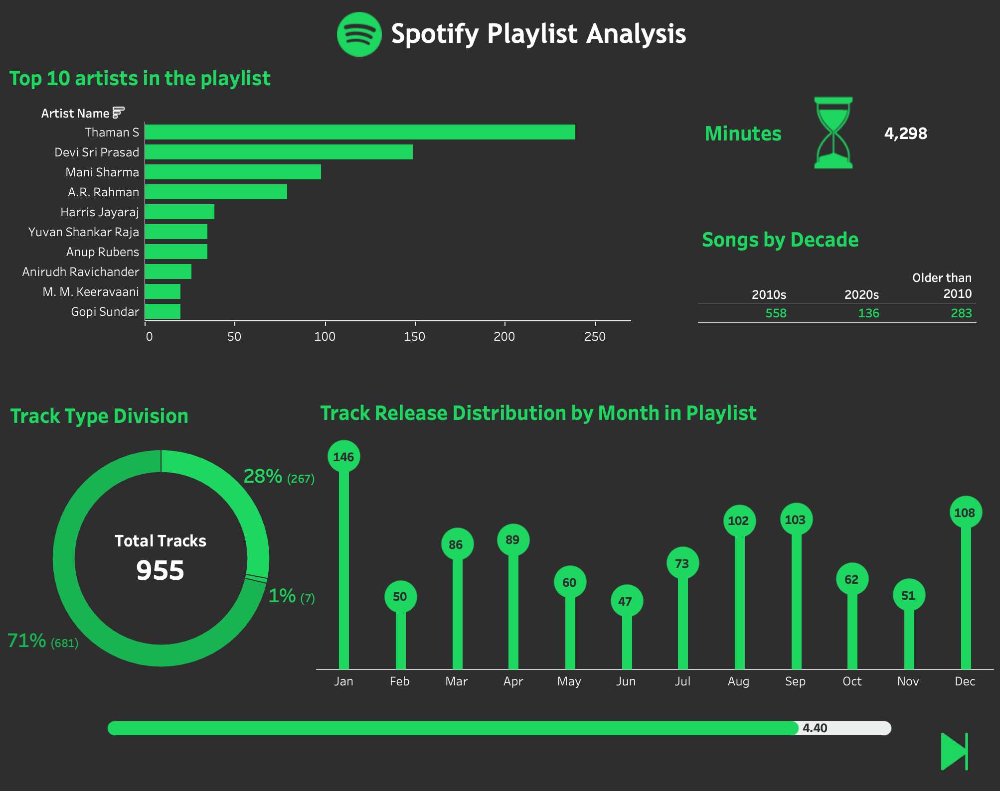
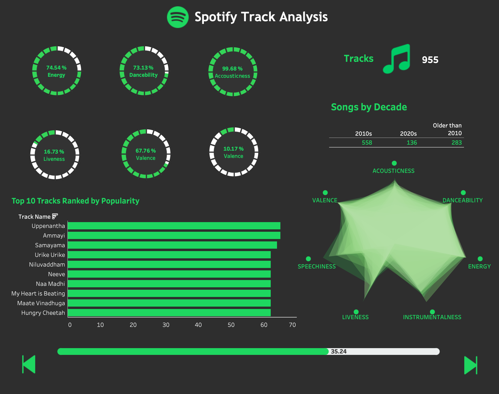
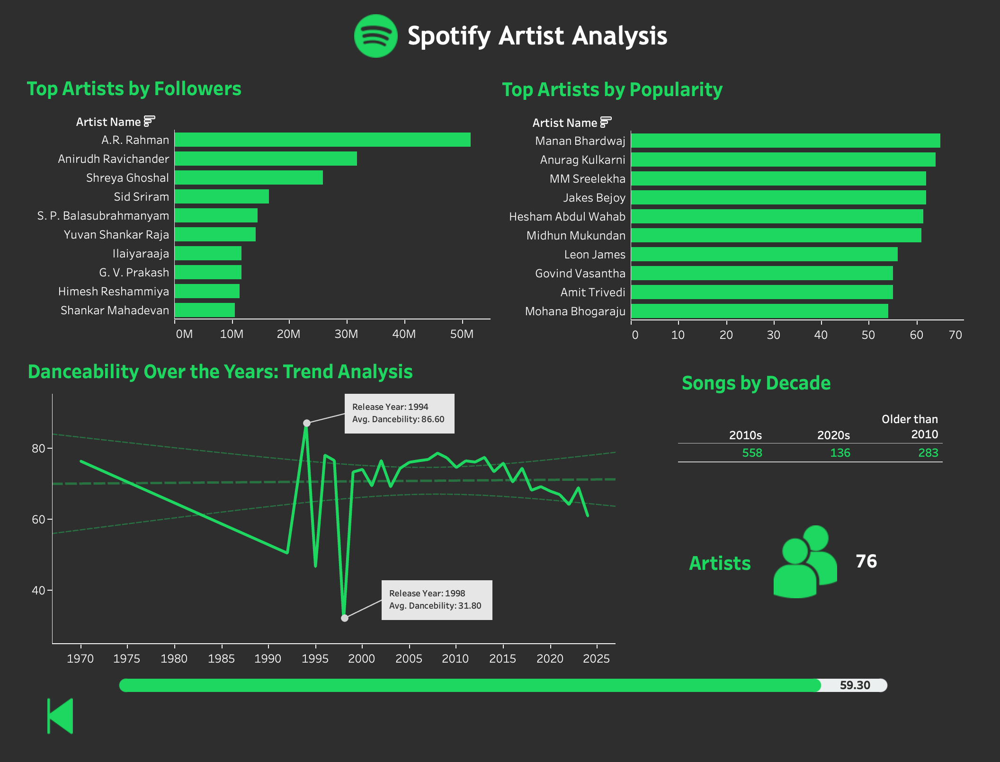

# Spotify Data Warehousing

  

## Project Overview

This project leverages the Spotify Web API to extract, process, and warehouse Spotify music data, providing a foundation for insightful analysis and visualizations on top of the processed data. It involves data collection, cleaning, and integration with Snowflake for efficient data storage and querying, followed by dashboard creation for exploring trends in music playlists, tracks, and artists.

## Table of Contents

- [Motivation](#motivation)
- [Features](#features)
- [Data Pipeline Overview](#data-pipeline-overview)
- [Technologies Used](#technologies-used)
- [Setup Instructions](#setup-instructions)
- [Usage](#usage)
- [Results](#results)
- [Future Work](#future-work)

## Motivation

This project aims to:
- Explore patterns and trends in Spotify music data.
- Practice data warehousing techniques and learn how to integrate APIs with Snowflake.
- Provide an interactive dashboard for users to analyze playlists, track audio features, and artist information.

## Features

- **Data Collection**: Utilizes the Spotify Web API to retrieve:
  - Playlists
  - Track audio features (e.g., danceability, energy, tempo)
  - Artist information
- **Data Cleaning and Transformation**: Processes raw data to improve consistency and usability.
- **Data Storage**: Loads cleaned data into Snowflake, enabling scalable querying and analytics.
- **Dashboarding**: Provides a dashboard to visualize trends in Spotify music data.

## Data Pipeline Overview

1. **Data Extraction**: Uses Spotify Web API to pull data on playlists, tracks, and artists.
2. **Data Cleaning & Transformation**: Cleans and structures the data using Python for compatibility with Snowflake.
3. **Data Loading**: Loads processed data into Snowflake, a cloud data warehouse.
4. **Visualization**: Connects the Snowflake data to Tableau to create interactive dashboards.

## Technologies Used

- **Spotify Web API** for data retrieval.
- **Python** for data extraction, cleaning, and transformation.
- **Snowflake** for warehousing structured data.
- **Tableau** for data visualization and dashboard creation.

## Setup Instructions

1. **Clone the Repository**:
   ```bash
   git clone https://github.com/bharath03-a/Spotify_DataWarehousing.git
2. **Install Dependencies**:
3. **Spotify API Authentication**:
4. **Configure Snowflake**:

## Results
The processed data and dashboards allow users to:
- Visualize music trends and popularity over time.
- Analyze audio feature patterns across different music genres.
- Explore artist popularity and track statistics.

### Dashboard Previews

Here are some previews of the dashboards created:


*Spotify Playlist Analysis*


*Spotify Track Analysis*


*potify Artist Analysis*

## Future Work
- Integrate additional Spotify data points, such as user listening history.
- Making it a scalable ETL pipeline my by providing playlist as input and generating a dashboard
- Optimize the ETL pipeline for real-time updates using tools like Apache Kafka.
- Expand dashboard insights with more interactive elements.